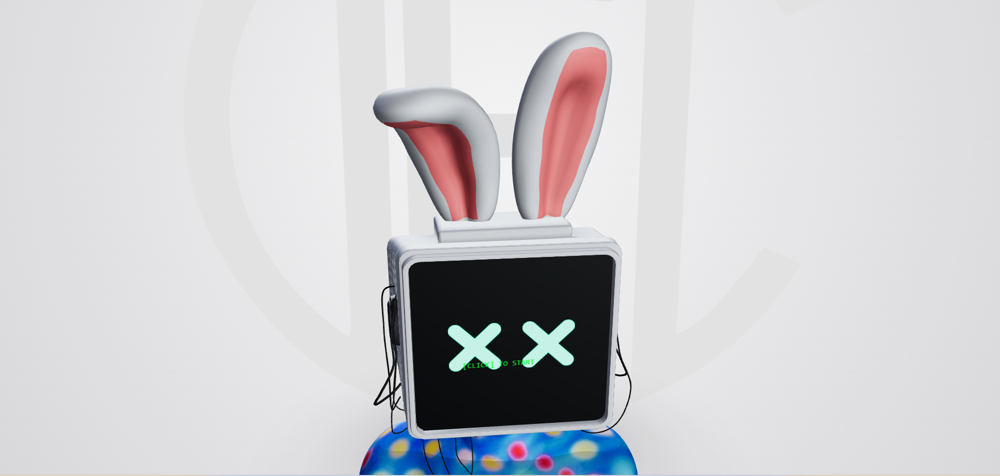

# DEC — Emi Interactive Portfolio




# DEC — Emi Interactive Portfolio

Interactive 3D portfolio for **Emilia Cristina Duculet (Emi)** — 3D
Artist, Graphic Designer, Scenographer & Web Designer.

The landing page is a real-time R3F scene: a rigged character (**Emy**,
`Emy.glb`) with a CRT-style screen for a head, standing in front of a
soft studio backdrop. Her head follows the cursor, her screen shows an
animated "click to start" prompt, and clicking it kicks off a
typewriter-driven dialogue (à la Locomotive's L.I.S.A) that branches
into the rest of the portfolio — Work, What I Do, About, and contact —
opened as an in-page popup rather than a page navigation, so Emi stays
visible behind a blurred backdrop the whole time.

## Structure

```
src/
  DialogueEngine.js        Zustand store: dialogue nodes, history, branching
  ModalStore.js             Zustand store: which popup "page" is open (work/what-i-do/about)
  EmiExperience.jsx         Canvas + Overlay + HomeModal composition root (route "/")
  emi.css                   Overlay styling (.c-emi_main, .c-emi-step, ...)
  main.jsx                  HashRouter setup: "/", "/work", "/work/:id", "/what-i-do", "/about"

  components/
    EmiModel.jsx             Loads Emy.glb, drives head tracking, fur, screen, click-to-start
    ScreenTexture.jsx        Canvas-based texture painted onto the Screen material (eyes/expressions)
    FurMaterial.jsx          Custom shell-shader fur effect applied to meshes using the "Fur" material
    BackgroundLogo.jsx       Textured plane logo placed behind Emy in 3D space
    Overlay.jsx              HTML dialogue panel: GSAP typewriter, choices, audio unlock, socials
    HomeModal.jsx / .css     In-page popup ("scheda") that reuses the /work, /what-i-do, /about content

  pages/
    WorkPage.jsx / .css          Standalone /work route
    WorkDetailPage.jsx / .css    Standalone /work/:id route
    WhatIDoPage.jsx / .css       Standalone /what-i-do route
    AboutPage.jsx / .css         Standalone /about route
    TechStackBalls.jsx / .css    Physics-driven (Rapier) tech-stack ball pit
    PageTopbar.jsx               Shared top navigation bar for the standalone pages
    workData.js                  Project data used by both the standalone pages and the popup
    content/                     Presentational content shared between standalone pages and HomeModal

  assets/
    emi/fx/ambient.mp3        Ambient loop, unlocked on first user gesture
    glitch1.jpg, glitch2.png, art_sketch.jpg   Source images for ScreenTexture

public/
  models/Emy.glb              Rigged character model (bone: HeadRotation; materials: Screen, Fur)
  models/char_enviorment.hdr  HDRI used for the studio Environment
  cv-emilia.pdf                Downloadable CV, linked from the dialogue
  images/                      Work grid + detail images, tool icons
```

## How the pieces fit together

**DialogueEngine.js** — the conversation tree Emi "speaks" through.
Each node has a `title`, a `line` (typewriter text), optional
`choices[]` (each pointing to a `next` node id and/or a `url`), and
`meta.crtMood` / `meta.showSocials` flags the UI reacts to. Choosing an
option with an internal `url` (`#/work`, `#/what-i-do`, `#/about`)
opens the in-page popup via `ModalStore` instead of navigating away;
external `url`s (mailto, the CV PDF) are followed directly.

**ModalStore.js** — a tiny second Zustand store so `Overlay.jsx`
(inside the Canvas) and `HomeModal.jsx` (outside it) can talk to each
other without prop-drilling: `openPage('work')` etc. sets which popup
is showing, `HASH_TO_MODAL_PAGE` maps the dialogue's `#/...` URLs to
popup pages.

**EmiModel.jsx** — loads `Emy.glb`, then each frame lerps the
`HeadRotation` bone toward the mouse position for the head-tracking
effect, subtly twitches the ears, and switches the `ScreenTexture`
expression (`off` / `on` / `happy`) based on dialogue state. Clicking
the mesh whose material is named `Screen` calls `start()` on the
dialogue store; before that click, an HTML-in-3D `"[CLICK] TO START"`
label (via drei's `<Html>`) is anchored to the head.

**ScreenTexture.jsx** — paints a `<canvas>` (glitch/eye imagery) and
feeds it into the `Screen` material as a live texture, keyed off the
`expression` prop so the face reacts to what's happening in the
dialogue.

**FurMaterial.jsx** — a custom shell-based fur shader (multiple
extruded shells with a frizz/sway vertex displacement) applied to any
mesh in the GLB using the `Fur` material.

**Overlay.jsx** — re-implements Locomotive's per-character split
animation without the paid GSAP SplitText plugin: every character
becomes its own `display:inline-block` span, and GSAP staggers their
opacity/`translateY`. When the stagger completes, `finishTyping()`
flips `showCursor` to `true`, toggling the `-show-cursor` class in
`emi.css`. Also owns the ambient-audio unlock (first `click`/`keydown`
on the page starts `assets/emi/fx/ambient.mp3`) and renders the social
links once `meta.showSocials` is true on the current node.

**EmiExperience.jsx** — composition root for route `/`: an R3F
`<Canvas>` renders `BackgroundLogo` + `EmiModel` + studio lighting and
`Environment`, with `Overlay` and `HomeModal` layered on top as plain
HTML.

## Routing

`HashRouter` is used (URLs like `/#/work`) so the app works unmodified
on any static host, without server-side rewrite rules:

| Route | Component |
|---|---|
| `/` | `EmiExperience` (the 3D landing + dialogue) |
| `/work` | `WorkPage` |
| `/work/:id` | `WorkDetailPage` |
| `/what-i-do` | `WhatIDoPage` |
| `/about` | `AboutPage` |
| `/career` | redirects to `/about` |

The same content also renders inside the in-page popup (`HomeModal`)
when reached from the dialogue, so a visitor never has to leave the 3D
scene unless they want the standalone page/URL.

## Running it

```bash
npm install
npm run dev
```

Build for production:

```bash
npm run build
npm run preview
```

## Tech stack

React 18 · Vite · `@react-three/fiber` · `@react-three/drei` ·
`@react-three/rapier` (tech-stack ball pit physics) ·
`@react-three/postprocessing` · GSAP · Zustand · React Router
(`HashRouter`) · custom GLSL (fur shells, CRT-style screen).
